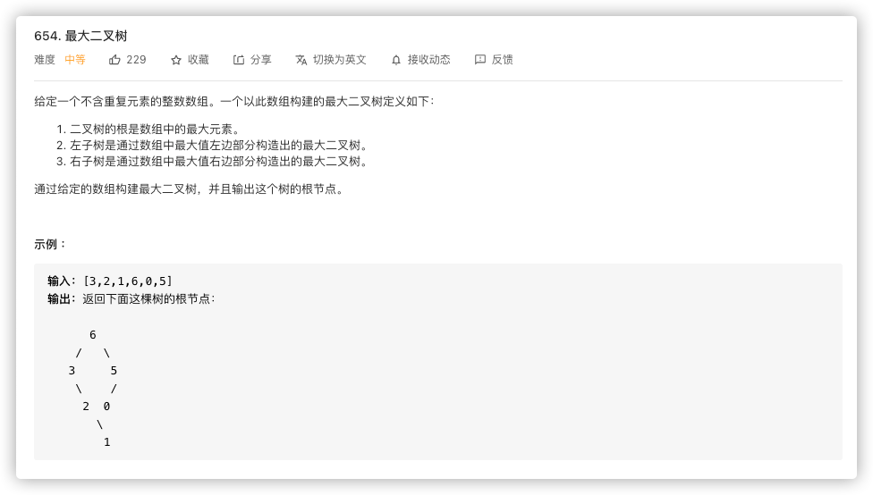
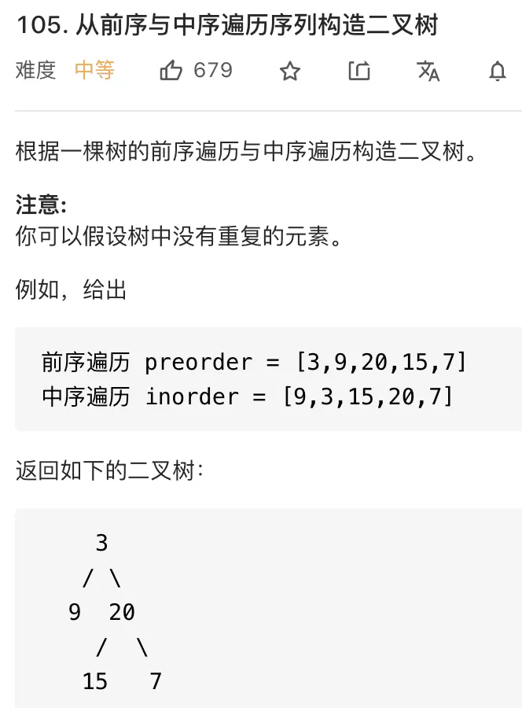
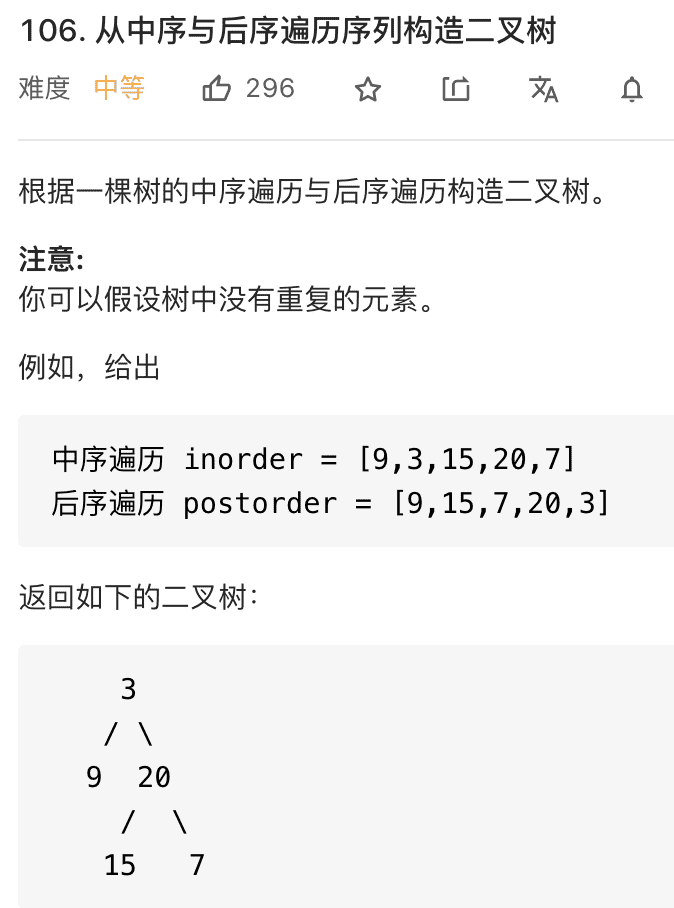
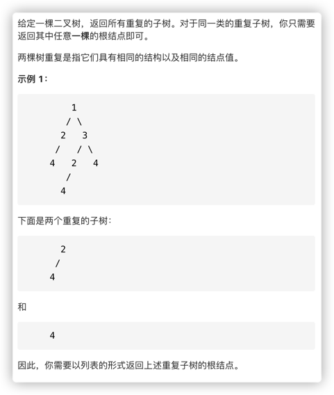
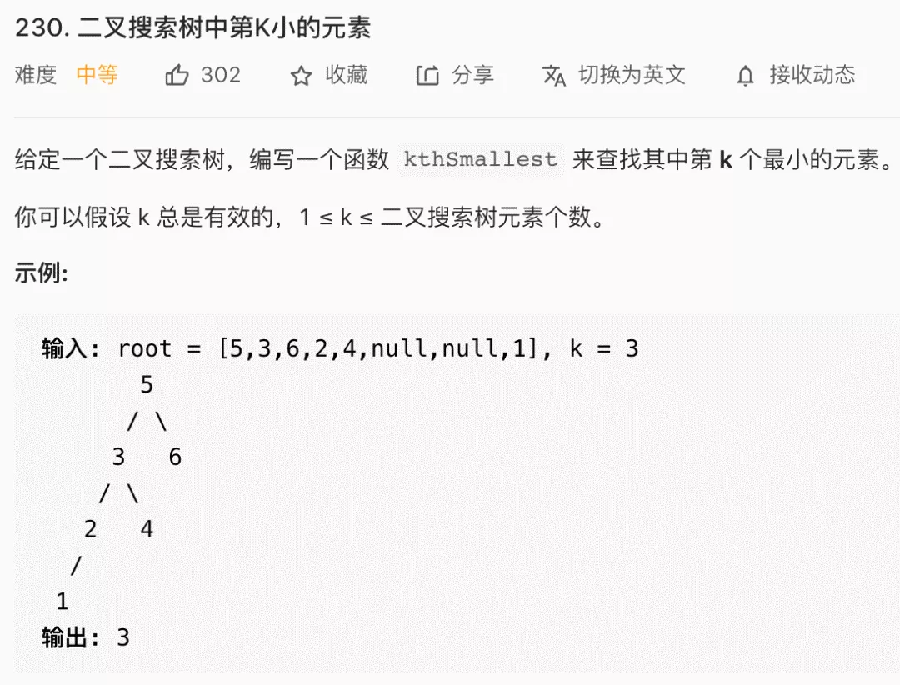
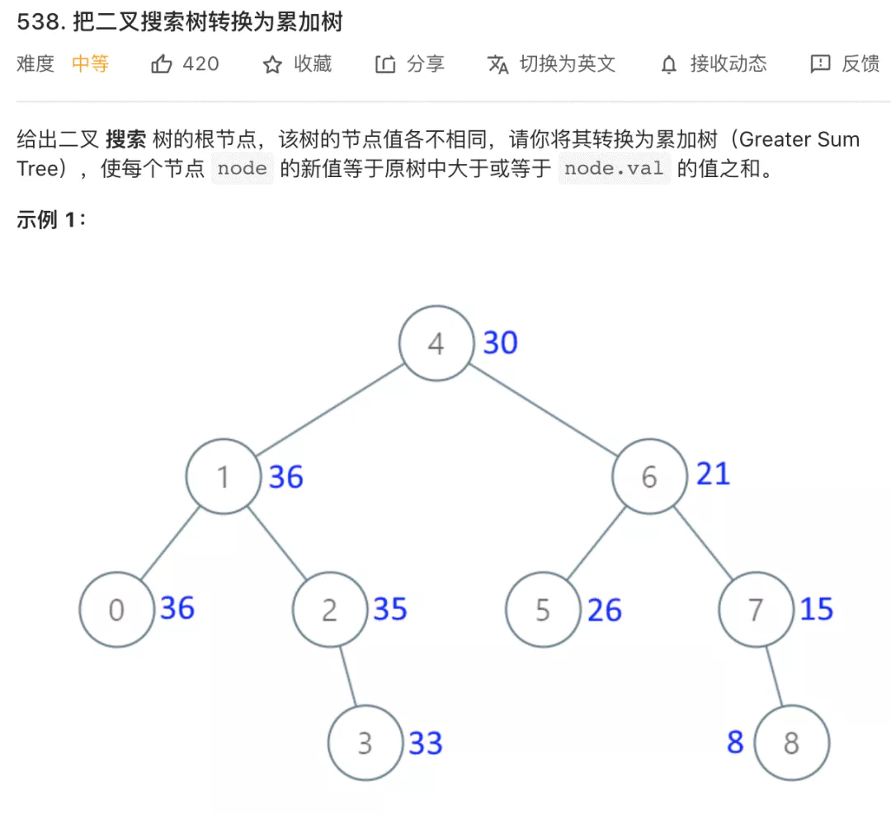

# 程序员代码面试指南

## 二叉树

### 翻转二叉树
>【题目】  
> 翻转一棵二叉树。
>【题解】  
> 前序的时候或者后序遍历的
>【leetcode] 226

### 二叉树展开为链表
>【题目】  
> 给定一个二叉树，原地将它展开为一个单链表。
>【题解】  
> 认清楚方法的功能，就是把一个节点和他的所有子节点拉平，那么把左边拉平，把右边拉平之后把右边接到左边
>【leetcode] 114

### 填充每个节点的下一个右侧节点指针
>【题目】  
> 给定一个完美二叉树，其所有叶子节点都在同一层，每个父节点都有两个子节点。二叉树定义如下：  
> struct Node {    
> int val;  
> Node *left;  
> Node *right;  
> Node *next;  
> }  
> 填充它的每个 next 指针，让这个指针指向其下一个右侧节点。如果找不到下一个右侧节点，则将 next 指针设置为 NULL。  
> 初始状态下，所有 next 指针都被设置为 NULL。  
>【题解】  
> 认清楚方法的功能，我们定义一个连接两个节点的方法, 这个方法的全部功能就是这两个节点本身连接起来，然后他们的四个子节点之间两两相连（3次递归调用连接两个节点的这个功能）
>【leetcode] 116

### 最大二叉树

### 从前序和中序遍历构造二叉树

### 从中序和后序遍历构造二叉树

### 寻找重复的子树

## 二叉搜索树

### 二叉搜索树中的第k小的元素

### 把二叉搜索树转换成类加树

>【题解】 
> 利用中序变量，但是把左右先后顺序颠倒，就可以维护一个从大到小的打印顺序  
> 这样只需要维护一个全局的sum就好了

## 栈和队列

### 设计一个有 getMin 功能的栈
>【题目】  
> 实现一个特殊的栈，在实现栈的基本功能的基础上，再实现返回栈中最小元素的操作。  
>【要求】  
> 1．pop、push、getMin 操作的时间复杂度都是 O(1)。  
> 2．设计的栈类型可以使用现成的栈结构。  
>【题解】  
> 双栈法，维护一个数据栈和一个最小栈  
>【leetcode】155

### 由两个栈组成的队列
>【题目】  
> 编写一个类，用两个栈实现队列，支持队列的基本操作（add、poll、peek）。  
>【题解】  
> push只需要往stack1中放  
> pop的时候检查stack2是否为空，要是为空则把stack1所有元素出栈并入栈到stack2
>【剑指offer09]

