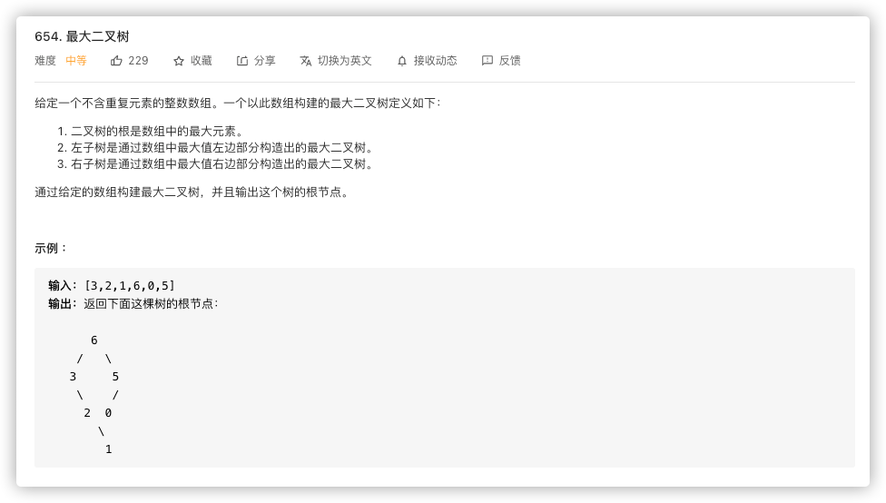
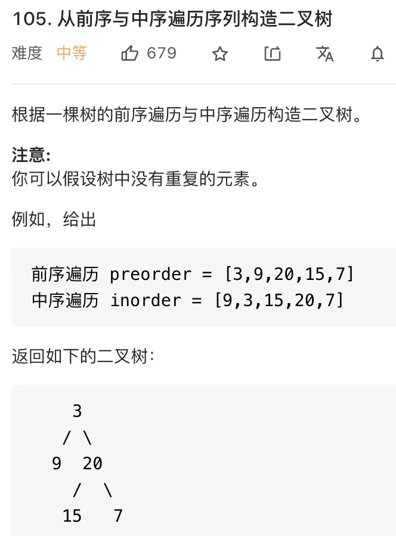
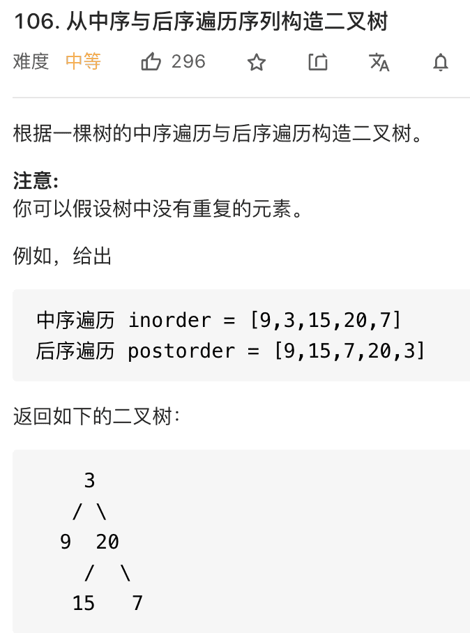
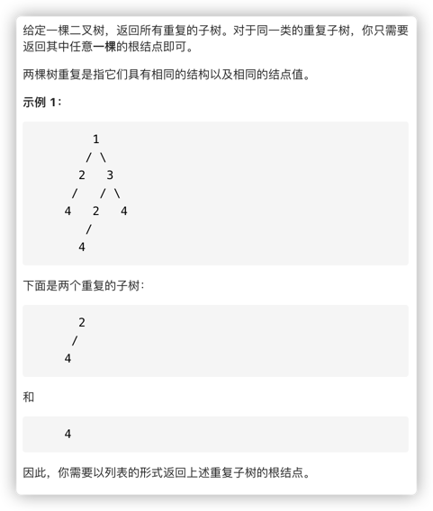
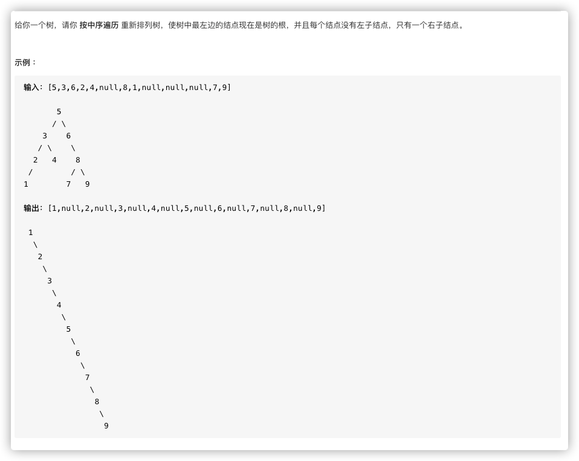
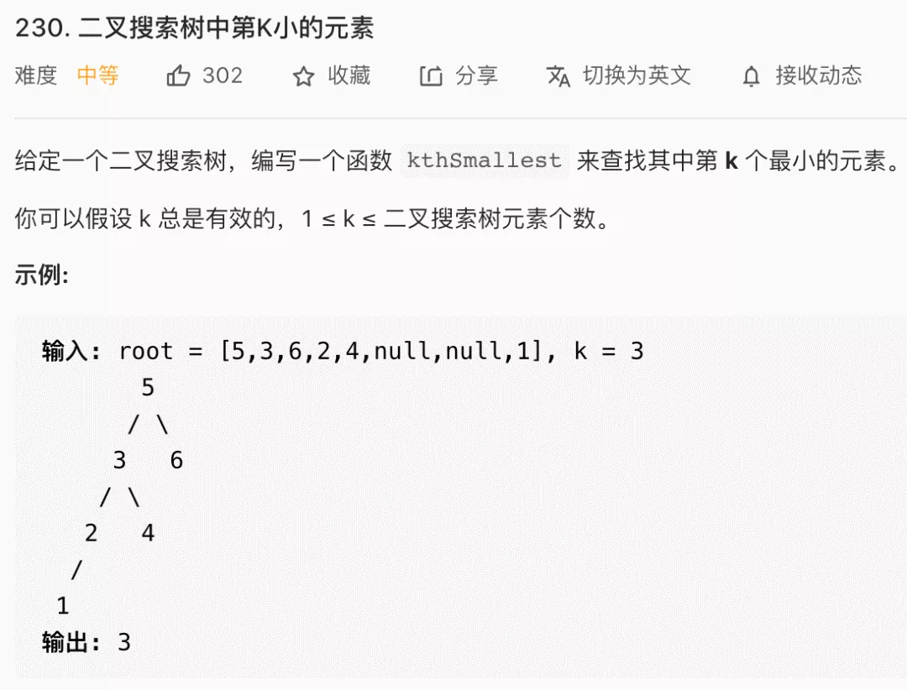

# Leetcode

## 二叉树
### 从根到叶的二进制数之和

### 路径总和

### 翻转二叉树

### 二叉树展开为链表

### 填充每个节点的下一个右侧节点指针

### 最大二叉树

### 从前序和中序遍历构造二叉树

### 从中序和后序遍历构造二叉树

### 寻找重复的子树

### 平衡二叉树

### 特定深度节点列表

### 递增顺序查找树

## 二叉搜索树

### 二叉搜索树中的第k小的元素

### 把二叉搜索树转换成类加树

>【题解】  
> 利用中序变量，但是把左右先后顺序颠倒，就可以维护一个从大到小的打印顺序  
> 这样只需要维护一个全局的sum就好了

## 栈和队列

### 设计一个有 getMin 功能的栈

### 由两个栈组成的队列
